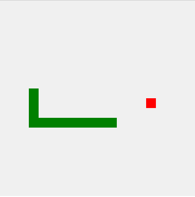

# Snake Game

This repository contains a simple implementation of the classic Snake game using HTML, CSS, and JavaScript.

## Getting Started

To get started, clone the repository to your local machine.

```bash
git clone https://github.com/your-username/snake-game.git
cd snake-game
```

Now, open the **snake.html** file in your web browser to play the game.

## Game Instructions

Use the arrow keys to control the direction of the snake.
The objective is to eat the red food that appears in game field, each piece of food eaten will increase the length of the snake.
Avoid colliding with the walls or yourself, as this will reset the game.

## Screenshot

<p align="center">
 
</p>

## License

This project is open-source and available under the [Unlicense](./LICENSE).
